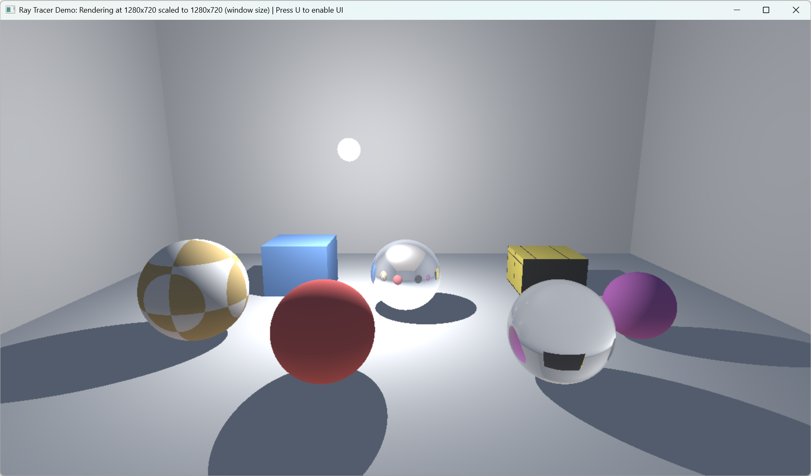
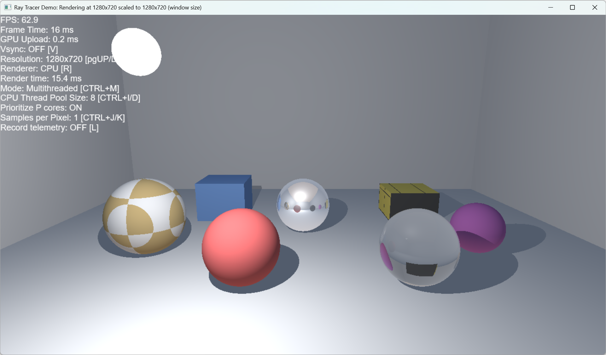
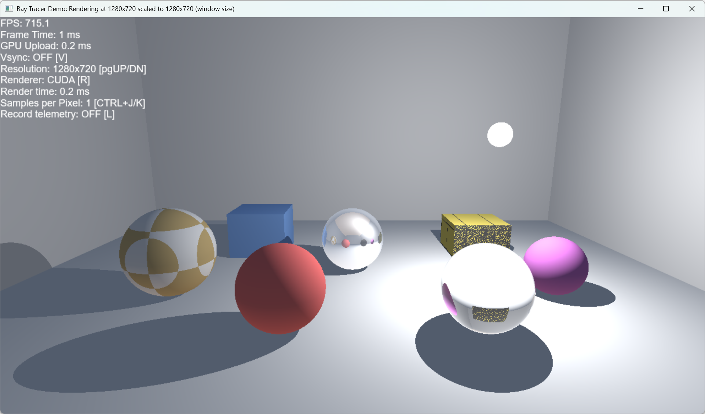

# RayTracer

Whitted Ray Tracer project built for a university course with the purpose of examining and evaluating differences between CPU (Sequential/Multithreaded) and GPU (CUDA) compute in real-time rendering workloads.

## Table of contents

- [Prerequisites](#prerequisites)
- [Quick Start](#quick-start)
- [Usage](#usage)
  - [Configuration options](#configuration-options)
  - [Screenshots](#screenshots)
- [Acknowledgements](#acknowledgements)

## Prerequisites
To build and run the project, make sure the following requirements are met:

- Microsoft Windows 10 **22H2** or Windows 11 **23H2+** operating system.
- Microsoft Visual Studio **2019, 2022, 2026** with **Desktop development with C++** and **Game development with C++** workloads installed.
- CPU with **SSE support**
- NVIDIA GPU with **CUDA** capability.
- NVIDIA CUDA Toolkit **12.x** or **newer** installed.
- CMake **4.0.0** or **newer** installed.

## Quick Start
1. Clone this repo:
```cmd 
git clone https://github.com/nooway077/RayTracer.git
```
2. Inside the RayTracer directory, run the `cmake_generate_project.bat` file. This will generate the CMake project, download and build the required third party packages.
3. Open the newly created ./build/RayTracer.sln with Visual Studio.
4. For the best performance on CPU, switch the **Solution Configuration** to **Release** and then build & run the application. 

## Usage
The application uses D3D12 as presentation layer with switchable renderer backends (CPU/CUDA). A simple UI is drawn over the viewport showing real-time frame statistics, active configuration settings and key combinations for changing some of the settings. To show / hide the UI, press the 'U' key.




### Configuration options
The application can render at the following resolutions: 

- 640x480
- 800x600
- 1280x720
- 1920x1080
- 2560x1440
- 3840x2160

**Note:** The rendering resolution is independent of the application's window resolution and will be scaled up or down automatically.
Use 'Page UP' and 'Page Down' keys to switch resolutions. Vertical Synchronization is implemented using D3D12's DXGI_SWAP_EFFECT_FLIP_* swap effects and can be enabled by pressing the 'V' key.

The application has two rendering backends implemented:

- **CPU Renderer [Sequential/Multithreaded]**
- **CUDA (GPU) Renderer**

The CPU Renderer in Multithreaded mode has user-configureable thread pool size which can be increased or decreased by pressing 'CTRL+I' or 'CTRL+D' keys. The CPU Renderer mode can be toggled with 'CTRL+M' keys between Sequential and Multithreaded options.
There is an option for x86 Hybrid Architecture CPUs (Intel Alder Lake and up) to Prioritize Performance Cores. When this is ON (default), a custom task scheduler observer tries to disable Efficiency-Core throttling via *SetThreadInformation*. To toggle this option, press the 'P' key.

The application can save frame telemetry statistics to disk using comma-separated values (CSV) with the following structure:

| FrameIndex | AbsoluteTimeSec | Renderer | RenderWidth | RenderHeight | TotalPixels | SamplesPerPixel | TimePerPixel | FrameTimeMs | RenderTimeMs | GpuUploadMs | VSync | CPUThreadPoolSize | PrioritizePCores |
| :---: | :---: | :---: | :---: | :---: | :---: | :---: | :---: | :---: | :---: | :---: | :---: | :---: | :---: |
| 181556 | 1385.75 | CUDA | 3840 | 2160 | 8294400 | 1 | 0.235802 | 7.3164 | 1.95584 | 1.85824 | 0 | 16 | 1 |
| 181557 | 1385.76 | CUDA | 3840 | 2160 | 8294400 | 1 | 0.235679 | 7.9358 | 1.95482 | 1.33219 | 0 | 16 | 1 |
| 181558 | 1385.77 | CUDA | 3840 | 2160 | 8294400 | 1 | 0.235556 | 6.6364 | 1.95379 | 1.33114 | 0 | 16 | 1 |

Press 'L' to enable telemetry recording. The telemetry file will be created next to the application's binary with this naming structure: `RayTracerStats_UNIX_TIMESTAMP.csv`
**Note:** The telemetry file will only be saved once the recording is stopped with 'L'. 

### Screenshots






## Acknowledgements

1.  "Ray Tracing From the 1980’s to Today An Interview with Morgan McGuire, NVIDIA." *NVIDIA Technical Blog*. Accessed: Mar. 15, 2026. Available: [https://developer.nvidia.com/blog/ray-tracing-from-the-1980s-to-today-an-interview-withmorgan-mcguire-nvidia/](https://developer.nvidia.com/blog/ray-tracing-from-the-1980s-to-today-an-interview-withmorgan-mcguire-nvidia/)
2.  Aila, T. and Laine, S. "Understanding the Efficiency of Ray Traversal on GPUs."
3.  Marrs, A., Shirley, P., and Wald, I. "Ray Tracing Gems II: Next generation real-time rendering with DXR, Vulkan, and OptiX." In *Ray Tracing Gems II: Next Generation Real-Time Rendering with DXR, Vulkan, and OptiX*. Aug. 2021. DOI: [10.1007/978-1-4842-7185-8](https://doi.org/10.1007/978-1-4842-7185-8)
4.  Wald, I. and Slusallek, P. "State of the Art in Interactive Ray Tracing."
5.  "Physically Based Rendering: From Theory to Implementation." *PBR Book*. Accessed: Mar. 15, 2026. Available: [https://www.pbr-book.org/4ed/contents](https://www.pbr-book.org/4ed/contents)
6.  "CUDA Programming Guide Release 13.2." *NVIDIA Corporation*. 2026.
7.  Harris, M. "Optimizing Parallel Reduction in CUDA."
8.	https://www.realtimerendering.com/raytracing.html
9.	https://github.com/microsoft/DirectX-Graphics-Samples
10.	https://github.com/microsoft/DirectX-Headers
11. https://github.com/microsoft/DirectXTK12/wiki/Writing-custom-shaders
12. https://github.com/uxlfoundation/oneTBB
